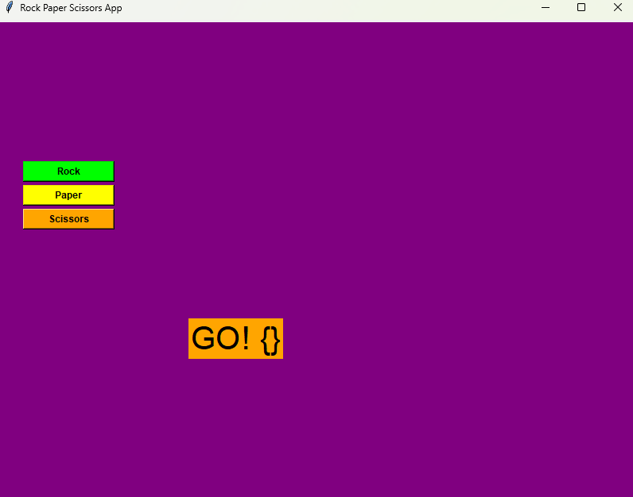

# Tkinter Rock Paper Scissors

First project practicing GUI and Event Driven Programming

---

## Table of Contents

- [Overview](#overview)  
- [Features](#features)  
- [Screenshots](#screenshots)  
- [Requirements](#requirements)

---

## Overview

The purpose of this project was to take a go at creating a program with a GUI for the user to interact with beyond the CLI. 

This application is a rock paper scissors game to be played by a user against random choice selected by the program. 

The program contains an array of quirks that remain as a feature. 
Improvements that could be made are: 
- Replacement instead of overlap of selection images
- Making images transparent rather than filling the background of them with a simailair colour to the program background
- Proper text formatting removing the braces in text displays
- Proper usage of the countdown and picture_clear functions
- Optimiation with implementation of Object Oriented Programming princaples 

---

## Features 

- Win draw and loss totals displayed
- Computer selection of the last match is displayed
- Picture of player selection displayed with each choice
- Fun colourful GUI

---

## Screenshots 

| Description | Description | Description |
|-------------|-------------|-------------|
|  |  |  |

---

## Requirements 

- python 3 ( python --version > 3.0.0 )
- PIL ( pip install pillow )