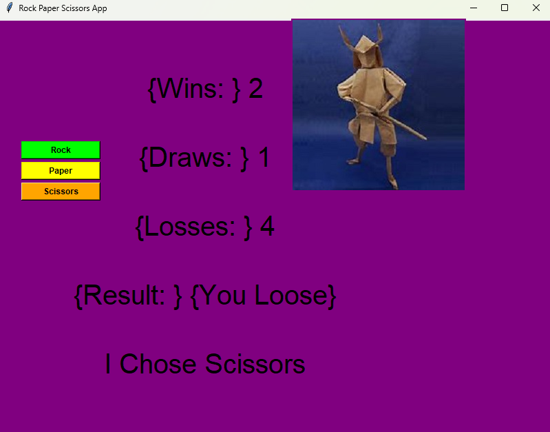
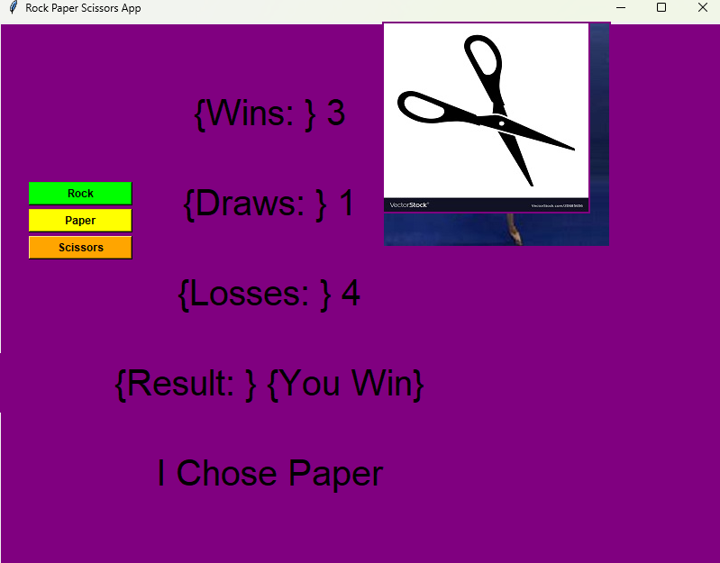

# Tkinter Rock Paper Scissors

First project practicing GUI and Event Driven Programming

---

## Table of Contents

- [Overview](#overview)  
- [Features](#features)  
- [Screenshots](#screenshots)  
- [Requirements](#requirements)  
- [Installation](#installation)  
- [Running the Program](#running-the-program)  
- [Configuration](#configuration)  
- [Project Structure](#project-structure)  
- [How It Works](#how-it-works)  
- [Known Issues](#known-issues)  
- [Future Improvements](#future-improvements)  
- [Lessons Learned](#lessons-learned)  
- [License](#license)

---

## Overview

The purpose of this project was to take a go at creating a program with a GUI for the user to interact with beyond the CLI. 

This application is a rock paper scissors game to be played by a user against random choice selected by the program. 

The program contains an array of quirks that remain as a feature. 
Improvements that could be made are: 
- Replacement instead of overlap of selection images
- Making images transparent rather than filling the background of them with a simailair colour to the program background
- Proper text formatting removing the braces in text displays
- Proper usage of the countdown and picture_clear functions
- Optimiation with implementation of Object Oriented Programming princaples

Provide a few paragraphs describing:
- The purpose of the project  
- What the application does  
- Why you created it  
- Any context (first GUI, early learning project, etc.)

---

## Features

List out the main features of the project:

- Feature 1  
- Feature 2  
- Feature 3  
- Feature 4  

---

## Screenshots

(Add images to your repo and update the paths.)

| Description | Description | Description |
|-------------|-------------|-------------|
|  |  |  |

---

## Requirements

List any dependencies or version requirements, for example:

- python 3 ( python --version > 3.0.0 )
- PIL ( pip install pillow )